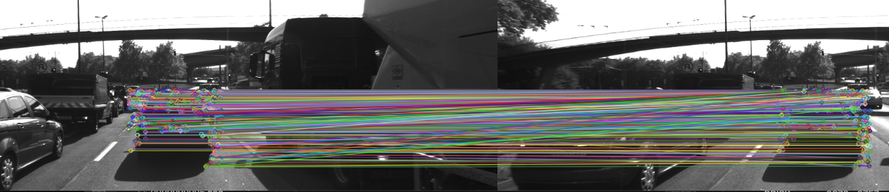
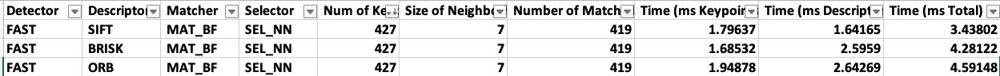

# SFND 2D Feature Tracking


The idea of the camera course is to build a collision detection system - that's the overall goal for the Final Project. As a preparation for this, you will now build the feature tracking part and test various detector / descriptor combinations to see which ones perform best. This mid-term project consists of four parts:

* First, you will focus on loading images, setting up data structures and putting everything into a ring buffer to optimize memory load. 
* Then, you will integrate several keypoint detectors such as HARRIS, FAST, BRISK and SIFT and compare them with regard to number of keypoints and speed. 
* In the next part, you will then focus on descriptor extraction and matching using brute force and also the FLANN approach we discussed in the previous lesson. 
* In the last part, once the code framework is complete, you will test the various algorithms in different combinations and compare them with regard to some performance measures. 

See the classroom instruction and code comments for more details on each of these parts. Once you are finished with this project, the keypoint matching part will be set up and you can proceed to the next lesson, where the focus is on integrating Lidar points and on object detection using deep-learning. 

## Dependencies for Running Locally
1. cmake >= 2.8
 * All OSes: [click here for installation instructions](https://cmake.org/install/)

2. make >= 4.1 (Linux, Mac), 3.81 (Windows)
 * Linux: make is installed by default on most Linux distros
 * Mac: [install Xcode command line tools to get make](https://developer.apple.com/xcode/features/)
 * Windows: [Click here for installation instructions](http://gnuwin32.sourceforge.net/packages/make.htm)

3. OpenCV >= 4.1
 * All OSes: refer to the [official instructions](https://docs.opencv.org/master/df/d65/tutorial_table_of_content_introduction.html)
 * This must be compiled from source using the `-D OPENCV_ENABLE_NONFREE=ON` cmake flag for testing the SIFT and SURF detectors. If using [homebrew](https://brew.sh/): `$> brew install --build-from-source opencv` will install required dependencies and compile opencv with the `opencv_contrib` module by default (no need to set `-DOPENCV_ENABLE_NONFREE=ON` manually). 
 * The OpenCV 4.1.0 source code can be found [here](https://github.com/opencv/opencv/tree/4.1.0)

4. gcc/g++ >= 5.4
  * Linux: gcc / g++ is installed by default on most Linux distros
  * Mac: same deal as make - [install Xcode command line tools](https://developer.apple.com/xcode/features/)
  * Windows: recommend using either [MinGW-w64](http://mingw-w64.org/doku.php/start) or [Microsoft's VCPKG, a C++ package manager](https://docs.microsoft.com/en-us/cpp/build/install-vcpkg?view=msvc-160&tabs=windows). VCPKG maintains its own binary distributions of OpenCV and many other packages. To see what packages are available, type `vcpkg search` at the command prompt. For example, once you've _VCPKG_ installed, you can install _OpenCV 4.1_ with the command:
```bash
c:\vcpkg> vcpkg install opencv4[nonfree,contrib]:x64-windows
```
Then, add *C:\vcpkg\installed\x64-windows\bin* and *C:\vcpkg\installed\x64-windows\debug\bin* to your user's _PATH_ variable. Also, set the _CMake Toolchain File_ to *c:\vcpkg\scripts\buildsystems\vcpkg.cmake*.


## Basic Build Instructions

1. Clone this repo.
2. Make a build directory in the top level directory: `mkdir build && cd build`
3. Compile: `cmake .. && make`
4. Run it: `./2D_feature_tracking`.

## Solution
### MP.1 Data Buffer Optimization
  Implement a vector for dataBuffer objects whose size does not exceed a limit (e.g. 2 elements). This can be achieved by pushing in new elements on one end and removing elements on the other end.

```
template <typename T>
void pop_front(std::vector<T> &v)
{
    if (v.size() > 0)
    {
        v.erase(v.begin());
    }
}
// Remove the old frame (front frame ),
if (dataBuffer.size() > dataBufferSize)
    {
        pop_front(dataBuffer);
        cout << "Remove the front image" << endl;
    }
```
###  MP.2 Keypoint Detection 
Implement detectors HARRIS, FAST, BRISK, ORB, AKAZE, and SIFT and make them selectable by setting a string accordingly. DONE, take alook at 2D_feature_tracking.cpp (line 97 to 103) and maching2D.cpp

### MP.3 Keypoint Removal
Remove all keypoints outside of a pre-defined rectangle and only use the keypoints within the rectangle for further processing.
```
  // only keep keypoints on the preceding vehicle
        bool bFocusOnVehicle = true;
        cv::Rect vehicleRect(535, 180, 180, 150);
        if (bFocusOnVehicle)
        {
            //Filter the key  point inside the preceding vehicle
            vector<cv::KeyPoint> keypoint_filter;
            for (auto kp : keypoints)
            {
                if (vehicleRect.contains(kp.pt))
                {
                    keypoint_filter.push_back(kp);
                }
            }
            keypoints = keypoint_filter;
        }
```

### MP.4 Keypoint Descriptors 
Implement descriptors BRIEF, ORB, FREAK, AKAZE and SIFT and make them selectable by setting a string accordingly.
DONE, take alook at 2D_feature_tracking.cpp (line 180 to 194) and maching2D.cpp

###  MP.5 Descriptor Matching & MP.6 Descriptor Distance Ratio
Implement FLANN matching as well as k-nearest neighbor selection. Both methods must be selectable using the respective strings in the main function. 

Use the K-Nearest-Neighbor matching to implement the descriptor distance ratio test, which looks at the ratio of best vs. second-best match to decide whether to keep an associated pair of keypoints.

DONE, take alook at 2D_feature_tracking.cpp (line 196 to 231) and maching2D.cpp

### MP.7 Performance Evaluation 1

Count the number of keypoints on all the origin picture for all 10 images. Do this for all the detectors you have implemented.

| Detector    | Num. keypoints  | Min Time (ms) |MaxTime (ms) |
| ----------- | ----------      | -----     | ----------------|
| FAST        |   4840 ~  4997  |   1.55603   | 1.60137       |
| BRISK       |   2672~ 2757    |   48.9019   | 49.8818       |
| AKAZE       |   1310~ 1363    |   54.1514   | 65.5247       | 
| SIFT        |   1305 ~ 1463   |   74.9289    | 75.8319      |
| Shi-Tomasi  |  1284~ 1389     |   8.39643   | 10.0517       |
| ORB         |   500           |   7.61273   | 7.87561       |
|  Harris     |   85 ~383       |   9.08098   | 21.9282       |

Count the number of keypoints on the preceding vehicle for all 10 images. Example FAST detector show in this picture below.

| Detector    | Num. keypoints  | Time (ms)   |
| ----------- | ----------      | -----       |
| FAST        |   396 ~423      |   2.59186   |    
| BRISK       |   254 ~289      |   54.6786   |  
| AKAZE       |   155 ~177      |   61.5338   |
| SIFT        |   137~159       |   79.3107   | 
| ORB         |   125 ~ 130     |   7.8601    |
| SHITOMASI   |   111 ~ 123     |   11.3577   | 
| HARRIS      |   18 ~ 26       |   11.5675   |

All data comparision in **/data/Result.xlsx**

### MP.8 Performance Evaluation 2

Count the number of matched keypoints for all 10 images using all possible combinations of detectors and descriptors. In the matching step, the BF approach is used with the descriptor distance ratio set to 0.8.

All data comparision in **/data/Result.xlsx**

### MP.9 Performance Evaluation 3

Log the time it takes for keypoint detection and descriptor extraction. The results must be entered into a spreadsheet and based on this data, the TOP3 detector / descriptor combinations must be recommended as the best choice for our purpose of detecting keypoints on vehicles.


All data comparision in **/data/Result.xlsx**
